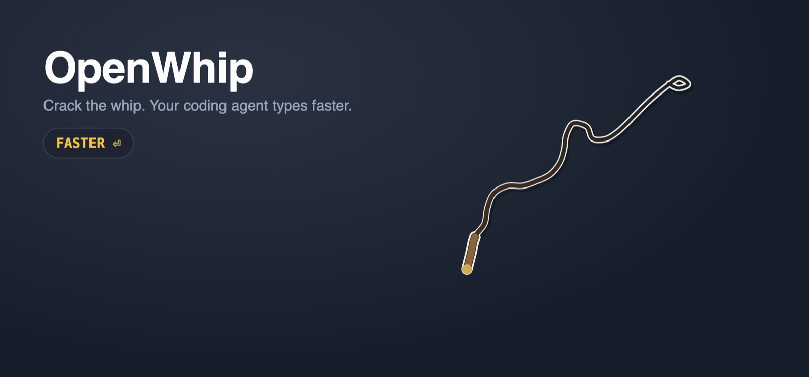

<div align="center">



# OpenWhip

**A tiny menu-bar whip for when your coding agent needs a little encouragement.**

[](https://github.com/jlfernandezfernandez/OpenWhip/releases/latest)
[](https://github.com/jlfernandezfernandez/OpenWhip/actions/workflows/ci.yml)
[](https://github.com/jlfernandezfernandez/OpenWhip/releases)
[](LICENSE)


</div>

Press **Ctrl/⌘ + Alt + W**, swing the mouse, and every crack types a short
message — **FASTER**, **GO FASTER**, **Speed it up clanker** — into whatever
has keyboard focus (a terminal, Teams, Slack, an IDE chat) and presses Enter.

- **Any input.** Types real keystrokes, full Unicode, into the focused app.
- **Minimal permissions.** macOS needs *Accessibility* only. Windows and Linux
  need nothing.
- **Zero idle cost.** The overlay sleeps when the whip is away.
- **Self-updating.** Downloads in the background, then *Restart to update*.
- **Small footprint.** Six source files, one native dependency.

## Install

Grab the installer for your platform from
[**Releases**](https://github.com/jlfernandezfernandez/OpenWhip/releases/latest).

| Platform | File                                    | Notes                                                                                                                          |
| -------- | --------------------------------------- | ------------------------------------------------------------------------------------------------------------------------------ |
| macOS    | `OpenWhip-*-mac-arm64.dmg` / `-x64.dmg` | Drag to Applications, then see [First launch on macOS](#first-launch-on-macos).                                                |
| Windows  | `OpenWhip-*-win-x64.exe`                | One-click installer, per-user, no admin rights.                                                                                |
| Linux    | `.AppImage` or `.deb`                   | Needs a typing helper: `xdotool` (X11) or `wtype` (Wayland). `ydotool` is used as a Wayland fallback if `ydotoold` is running. |

### First launch on macOS

OpenWhip is not notarized (that needs a paid Apple Developer account), so
Gatekeeper blocks the first launch. Nothing is wrong with your Mac. Either:

- Open **System Settings → Privacy & Security**, scroll down and click
  **Open Anyway** next to OpenWhip, or
- run once in Terminal:

  ```bash
  xattr -dr com.apple.quarantine /Applications/OpenWhip.app
  ```

If you see *"OpenWhip is damaged and can't be opened"*, use the Terminal
command — that wording is what macOS shows for unsigned downloads.

### Permissions

- **macOS** — *Accessibility* only. The first crack shows the system prompt;
  enable OpenWhip in **System Settings → Privacy & Security → Accessibility**.
  Until then the tray menu offers **Allow keyboard access…**. Keystrokes go
  through CoreGraphics, so there is no AppleScript and no extra *Automation*
  prompt. Releases are signed with a stable certificate, so the grant survives
  updates.
- **Windows / Linux** — nothing.

OpenWhip never reads the screen, listens to the keyboard, or talks to anything
but GitHub Releases for updates.

## Use

1. Press **Ctrl/⌘ + Alt + W** or click the tray icon → **Start whipping**. The
   whip appears under your pointer on that display.
2. Move the mouse to swing it. Snap it fast enough and it cracks.
3. Click (or press the shortcut again) to drop it; it falls off screen and the
   overlay goes idle.

The overlay never takes focus, so the app you were typing in keeps receiving
the messages. The tray menu only shows what is relevant: start/drop, a pending
update, the macOS permission prompt while it is missing, and Quit.

## Updates

OpenWhip checks GitHub Releases on launch and every few hours, downloads the
new version in the background and then shows **Restart to update** at the top
of the tray menu. Nothing to configure.

- **macOS** — the `.zip` for your architecture is downloaded, its SHA-256 is
  verified against the release, and the app bundle in `/Applications` is
  swapped atomically. No new `.dmg` to open.
- **Windows / AppImage** — handled by `electron-updater`; applied on restart
  (or on quit).
- **`.deb`** — notify only; the menu item opens the release page.

**Coming from a version before 2.1.3?** Versions 2.0.x have no updater:
download the latest installer once and install it over the old copy. On macOS
the first crack will ask for Accessibility again (the old grant was tied to
the old build's signature); OpenWhip clears the stale entry for you, so just
enable it in the prompt. From then on, updates are automatic and keep the
permission.

## How it works

```
src/
  main.js      tray menu, overlay window, global shortcut, IPC
  overlay.js   whip physics + rendering — fixed-step Verlet rope, HiDPI canvas
  typer.js     keystroke injection: CoreGraphics (macOS), SendInput (Windows),
               xdotool / wtype / ydotool (Linux)
  updater.js   background updates: GitHub Releases API (macOS), electron-updater
  preload.js   sandboxed bridge between overlay and main
```

The whip is a 28-link Verlet rope with tapered links, bend limits (stiff near
the handle, floppy at the tip), screen-edge bounces and a spring-loaded handle
that follows mouse motion. Physics runs at a fixed 60 Hz and rendering
interpolates between steps, so it feels the same on 60 and 144 Hz displays.
A crack is detected when the tip exceeds a speed threshold.

## Development

```bash
npm install     # Node ≥ 22.12
npm start
```

`npm run dist:mac` / `dist:win` / `dist:linux` build a local installer into
`dist.noindex/`. Pushing a tag like `v2.2.0` builds all installers — macOS
arm64 and Intel, Windows, Linux — and publishes a GitHub release.

## Credits

OpenWhip started as a fork of
[GitFrog1111/OpenWhip](https://github.com/GitFrog1111/OpenWhip) — the original
idea, the whip icon and the crack sounds come from there. Version 2 is a ground-up
rewrite: new input layer, renderer, updater, packaging and signing.

## License

[MIT](LICENSE)
